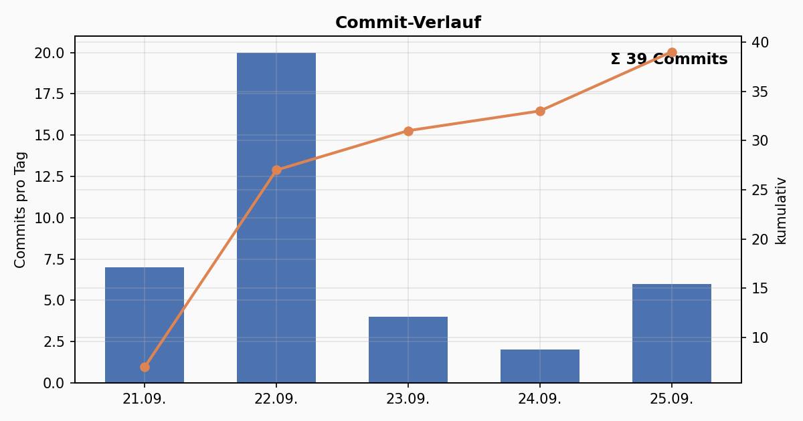
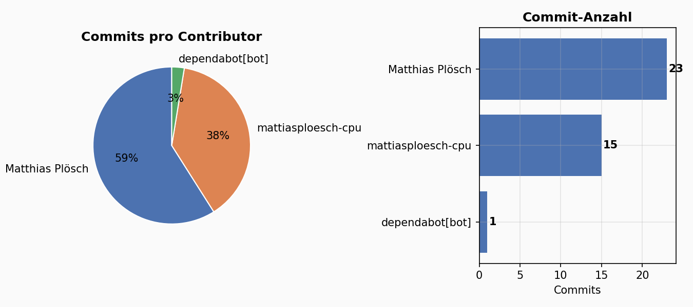
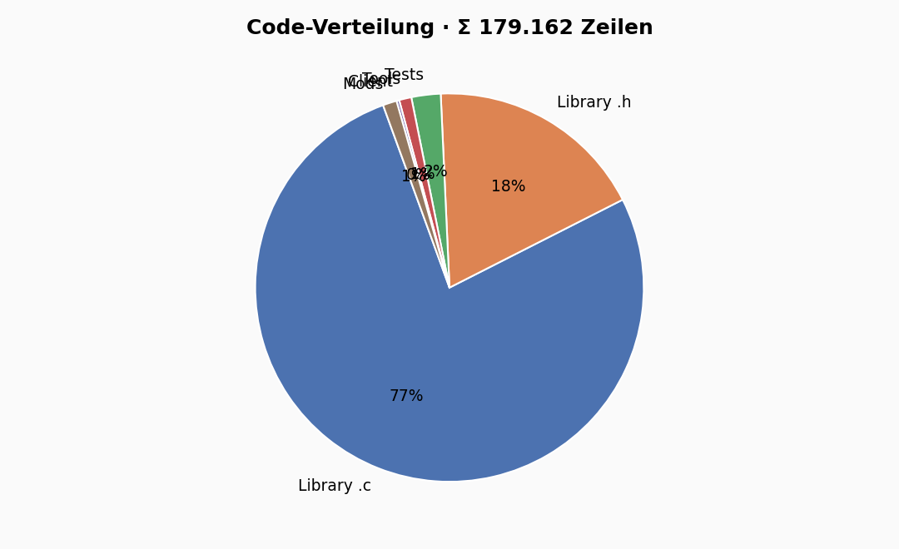
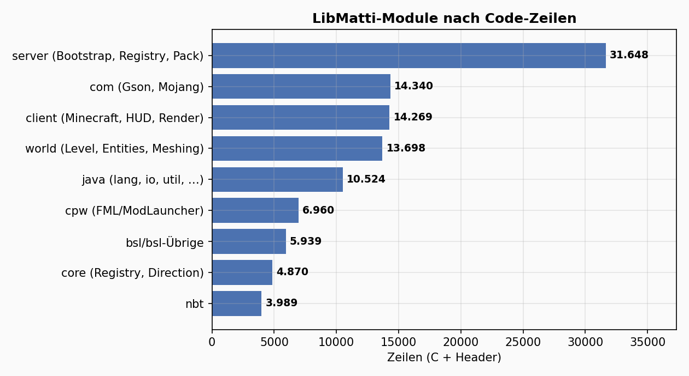
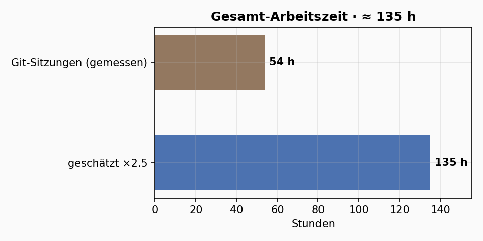
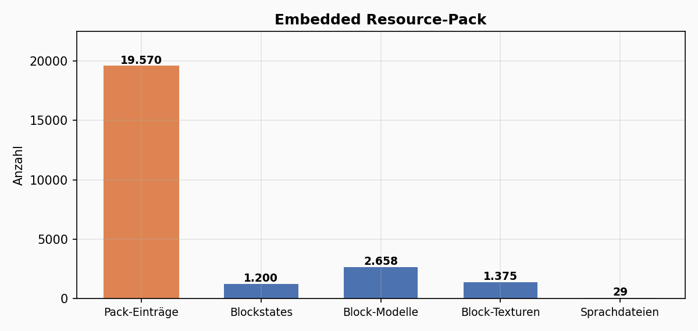

# Matticraft / LibMatti — Projekt-Statistiken

> Live generiert am 26.09.2026, 13:44 · Stand: Branch `feat/p5.5-gamerenderer-hud` · Commit `ea4bd349`

> Diese Datei wird von `tools/statistics.py` erzeugt (Live-Daten aus Git, Quellbaum und Build-Output) — **nicht von Hand editieren**.

## Übersicht

| Metrik | Wert |
|---|---:|
| Commits | **39** |
| Feature-Branches | 12 |
| Contributors | 3 |
| Projektzeitraum | 2026-09-21 → 2026-09-25 |
| Arbeitszeit (gesamt) | **≈ 135 h** |
| Eigener Code | **179.162 Zeilen** |
| Öffentliche `LIBMATTI_*`-Funktionen | 5.131 |
| `typedef struct`-Definitionen | 780 |
| Tests | 27 Programme · 337 Assertions |
| Binary `matticraft` | 20,2 MB (inkl. 13,5 MB Resource-Blob) |

## Commits & Contributors

| Contributor | Commits | Anteil |
|---|---:|---:|
| Matthias Plösch | 23 | 59 % |
| mattiasploesch-cpu | 15 | 38 % |
| dependabot[bot] | 1 | 3 % |

## Code-Umfang

| Bereich | Dateien | Zeilen |
|---|---:|---:|
| Library `.c` | 634 | 137.822 |
| Library `.h` | 667 | 32.679 |
| Tests | 31 | 4.356 |
| Tools | 9 | 1.829 |
| Client | 5 | 413 |
| Mods | 6 | 2.063 |
| **Gesamt** | **1.352** | **179.162** |

## Arbeitszeit

Die Git-Sitzungen messen 54 h — das ist nur die Zeit, die in Commits endete. Planung, Java-Referenz-Studium (MCP-Reborn) und Debugging kommen dazu: **≈ 135 h Gesamtaufwand** (Faktor 2.5 auf den gemessenen Umfang).

## Embedded Resource-Pack

| Inhalt | Anzahl |
|---|---:|
| Dateien gesamt | 19.570 |
| Blockstates | 1.200 |
| Block-Modelle | 2.658 |
| Block-Texturen | 1.375 |
| Sprachdateien | 29 |
| Baum-Größe | 24,0 MB |

## Projektfortschritt (plan.md)

| Phase | abgeschlossene Punkte |
|---|---:|
| P0 — Fundament-Bibliotheken (MC setzt sie überall voraus) | 4 |
| P1 — Registry- & Resource-Kern (verbindet MC an deine FML-Arbeit) | 5 |
| P2 — Domänen-Kern (die „Welt“ als Datenmodell) | 6 |
| P3 — Fenster & Rendering-Basis (der erste sichtbare Durchbruch) | 7 |
| P4 — Welt rendern | 5 |
| P5 — Spieler & Interaktion | 5 |
| P6 — Inventar/GUI | 0 |
| P7 — Speichern & Generierung | 0 |
| P8 — Multiplayer (optional, zuletzt) | 0 |
| Parallel-Strang: Mod-API-Vorderseite (damit Mods davon profitieren) | 0 |
| Test-Harness-Übersicht (alles unter `tests/`, gebaut über CMake, `ctest`) | 0 |
| Nächste sinnvolle Schritte (Reihenfolge-Vorschlag) | 9 |

---

*Erzeugt von `tools/statistics.py` (numpy + matplotlib). Plots liegen unter `docs/stats/`.*
